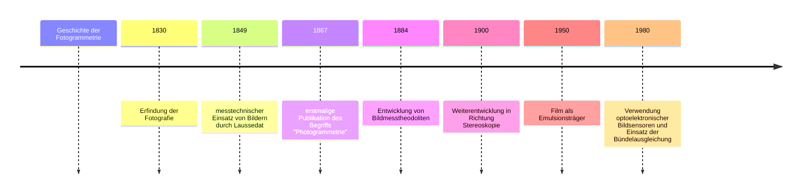
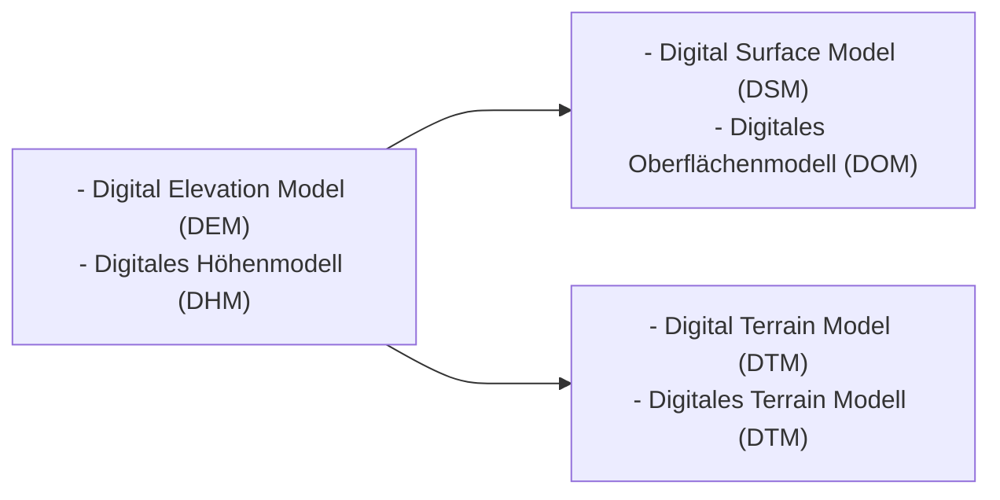

Raster und Vektordateien
- Vektordateien muss jeder Punkt eine Koordinate haben. In Rasterdaten reicht ein gefixter punkt, was eine effizientere Datenmenge ermöglicht.

## Koordinatenreferenzsysteme

![[Pasted image 20231024092444.png]]
![[Pasted image 20231024092838.png]]

Projektionen entweder Winkel- oder Flächentreu

### Schweizerische Landesvermessung (LV95)

  

1. **Winkeltreue Abbildung Ellipsoid –Kugel** 
2. **Winkeltreue Abbildung Kugel –Ebene (Zylinder)**

Aktueller GNSS Bezugspunkt in Zimmerwald

![[Pasted image 20231024093526.png]]

  

**EPSG Code** European Petroleum Survey Group Geodesy

**Wichtige Codes**
- EPSG 2056 CH1903+ / LV95
- EPSG 21781 CH1903 / LV03
- EPSG 4326  WGS84 World GeodeticSystem 1984

> [!Recap]
> - Koordinatenreferenzsystem
> 	- **Bezugssystem** (Mathematische Näherung an die Erdform)
> 	- **Projektionssystem** (Abbildung der Erdoberfläche auf die Ebene)
> 	- **Koordinatensystem** (Beschreibung der Lage im Raum)
> 	- **Bezugsrahmen** (physisches Stützpunktnetz)
> - Unterschiedliche Typen von Geodaten
> 	- Raster
> 		- 1-Band
> 		- Mehrband
> 	- Vektoren
> 		- Punkt (Punktwolke)
> 		- Linie
> 		- Polygon (Mesh)

Grundlagenliteratur: [Thomas Luhmann Nahbereichsphotogrammetrie](https://ubbern.swisscovery.slsp.ch/discovery/fulldisplay?docid=alma99116806467305511&context=L&vid=41SLSP_UBE:UBE&lang=de&search_scope=MyInstitution&adaptor=Local%20Search%20Engine&tab=LibraryCatalog&query=any,contains,Thomas%20Luhmann%20photogrammetrie&sortby=date_d&facet=frbrgroupid,include,9031528924527414014&offset=0)

## 2. Sitzung

### Produkte der Fotogrammetrie

![[Pasted image 20231031082445.png]]

![[Pasted image 20231031083010.png]]

### Geschichte der Fotogrammetrie

### Methode und Ablauf

![[Pasted image 20231031085255.png]]

#### Passpunkte
- Punkte im Gelände als Referenzpunkte vor dem Überflug
- Ganzes Gebiet muss gut abgedeckt sein
- GNSS Einmessung (Abweichung 1-2cm)

#### Fotografie

![[Pasted image 20231031091754.png]]

![[Pasted image 20231031091938.png]]

##### Zeilen- und Flächensensoren
![[Pasted image 20231031091938.png]]
CCD = charge-coupled device
$$
\begin{equation}
\eta = \frac{n_E}{n_P}
\end{equation}
$$
$$
\begin{align*}
\eta & = \text{Quantenwirkungsgrad} \\
n_E & = \text{Anzahl erzeugter Ladungsträger} \\
n_P & = \text{Anzahl Photonen}
\end{align*}
$$

- Kaum mehr verwendet da teuer und mühsam
##### CMOS - Sensoren

![[Pasted image 20231031092414.png]]

- Jedes einzelne Pixel kann die Lichtinformation selber verarbeiten
- Kleinerer Energieverbrauch
###### Rolling Shutter / Global Shutter

Global shutter bevorzugt, rolling shutter verurasacht gerade in Bewegung gewisse Verzerrungen.

#### Bildspeicherung digital - Farben

![[Pasted image 20231031093056.png]]
Bayer Muster erfordert eine Interpolation zwischen den umliegenden Pixeln.

 ![[Pasted image 20231031093552.png]]

$$
\begin{align*}
R_{Grün} = \frac{R_1 + R_2}{2} \\
\\
B_{Grün} = \frac{B_1 + B_2}{2}
\end{align*}
$$

#### Bildmassstab

![[Pasted image 20231031094649.png]]

> [!Aufgabe]
> In welchem Abstand muss ein Bild aufgenommen werden damit ein 10 m grossesObjekt formatfüllend abgebildet wird. Die verwendete Kamera hat einen Vollformatsensor und eine Brennweite von 40 mm.

Die Formel, die wir benötigen, um die Distanz $D$ zu finden, bei der ein Objekt mit der Höhe $H$ formatfüllend auf einem Sensor mit der Höhe  $h$ und einer bestimmten Brennweite $f$ fotografiert werden kann, ist:

$$
D = \frac{H \cdot f}{h}
$$

Für einen Vollformatsensor beträgt die Höhe $h$ 24 mm (da wir davon ausgehen, dass die Höhe des Objekts im Verhältnis zur Höhe des Sensors steht und nicht zur Breite oder Diagonale). Wir können also die Formel wie folgt anwenden:

$$
D = \frac{10'000 \text{ mm} \cdot 40 \text{ mm}}{24 \text{ mm}}
$$

Daraus folgt:

$$
\begin{align*}
D &= \frac{40'0000 \text{ mm}^2}{24 \text{ mm}} \\
\\
D &= 16'666.\overline{6} \text{ mm} \\
\\
D &= \underline{\underline{16.\overline{6} \text{ m}}}
\end{align*}
$$
### Woche 8

### Innere und äussere Orientierung

- Innere Orientierung := Brennweite, Lage des Hauptpunktes, Optische Verzeicchnungen, Bildkoordinaten der Rahmenmarken
- Äussere Orientierung := Die äussere Orientierung definiert die Lage und die Orientierung des Luftbildes im Moment der Aufnahme.

### Merkmalsextraktion

Mit **Interest-Operatoren** bezeichnet man Algorithmen zur Extraktion markanter Bildstellen, die  sich als Kandidaten für eine Bild zu Bild-Zuordnung eignen. 

Anforderungen an Interest-Operator:

- Deutlichkeit (lokale Einzigartigkeit, Unterscheidbarkeit vom Hintergrund)
- Invarianz (gegenüber geometrischen und radiometrischen Verzerrungen, z.B. Rotationen, Skalierungen, perspektive Abbildungen)
- Robustheit (Unempfindlichkeit gegen Rauschen)
- Seltenheit (globale Einzigartigkeit, Unterscheidbarkeit zu anderen Kandidaten)
- Interpretierbarkeit

### Relative Orientierung
Die relative Orientierung eine Stereobildpaares beschreibt die räumliche Translation und Rotation eines Bildes relativ zum Stereopartner in einem gemeinsamen lokalen Modellkoordinatensystem.

**RANSAC** (random sampel consensus) beschreibt einen zufallsbasierten Such – und Optimierungsprozess für ein beliebiges funktionales Modell, der besonders robust gegenüber Ausreißern ist, die z.T. bis zu 80% eines Datensatzes betragen.

### Bündelblockausgleich

Rechnerisch, iterative Bestimmung aller Unbekannten der 6 Parameter für die absolute Orientierung des Luftbildes:

- Landeskoordinaten Projektionszentrum  X, Y, Z
- Kameraausrichtung / Drehwinkel  ω, φ, κ

- Merkmale
	- Verknüpfung der einzelnen Bilder mithilfe identischer Punkte
	- Vollständige dreidimensionale Rekonstruktion
	- kleine Anzahl Passpunkte notwendig

### vom 3D Modell zum Digital Elevation Model (DEM)

![[Pasted image 20231107094147.png]]
![[Pasted image 20231107094432.png]]

- Verschiede Wege um zu bestimmen welcher Wert einer Zelle zugeordnet werden soll. Je nach Anwendung ergeben unterschiedliche Sachen Sinn. (Median robuster, mittelwert allgemeiner, etc.) Diverse Interpolationsmethoden.
- Eigentlich umwandlung von einem Vektordatensatz zu einem Rasterdatensatz.
	- Die Punkte könnten natürlich auch ein anderes Attribut als die Höhe haben.

### Erstellung eines Orthofotos

![[Pasted image 20231107094730.png]]

- einheitlicher Massstab
- Ausgleich von Verkippungen
- georeferenziert
![[Pasted image 20231107094924.png]]
![[Pasted image 20231107095119.png]]

#### Orthomosaik

Wenn ein Pixel von mehreren Bildern gebildet werden kann:
Folgende Möglichkeiten:

- Farbwert aus dem Bild mit dem kleinsten Bildwinkel 
- Farbwert aus dem Bild am nächsten zur Bildmitte
- Farbwert wird gemittelt
- maximaler oder minimaler Farbwert 
- möglichst „sanfte“ Farbübergänge

