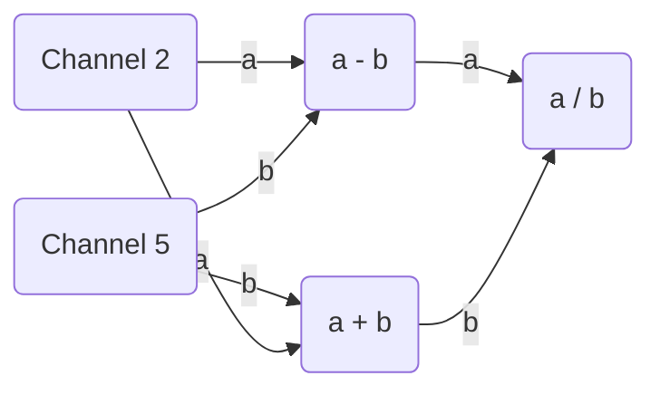
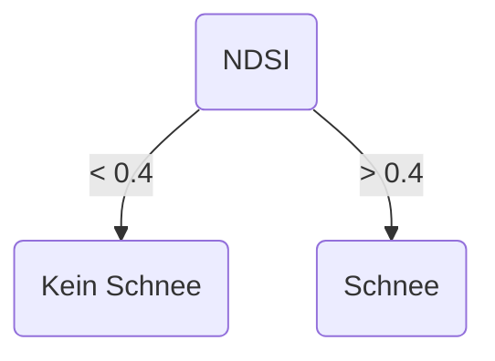
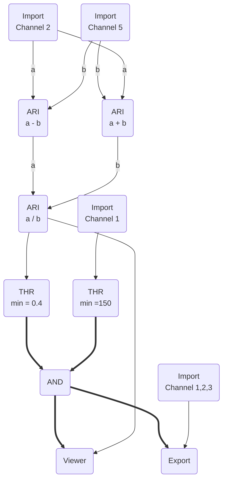

> Woche 3:
> - Klassifizierung
> 	- überwacht und unüberwacht
> 	- Gebiete mit ähnlicher Signatur (bspw. Siedlung und Geröllfeld im Alpenraum) werden gleich
> - Algorithmen zur Zuordnung von Pixel zu Klassen
> 	- Parallelepiped
> 	- max. likelyhood
> 	- min. distance

## Fernerkundung von Schnee
![[Pasted image 20231010082940.png]]

- im sichtbaren Bereich ist die Reflektanz von Schnee fast perfekt
- im nahen Infrarot wir teilweise die gesamte Strahlung absorbiert
- in abhängigkeit von der Schneekorngrösse ändert sich die Reflektanz
	- im Verhältniss zu der Dichte der Schneedecke
- Die Schneekorngrösse nimmt mit dem Alter der Schneekörner zu, also hat eine ältere Schneedecke eine geringere Reflektanz als eine frische
- Schnee und Wolken zu trennen, ist im sichtbaren Bereich fast nicht möglich, im nahen Infrarot unterscheidet sich die Signatur allerdings stark
- Bedingungen für diese Grafik
	- 100% Schneebedeckung des Pixels
	- Exposition (Nord- oder Südhang)
	- Verschmutzung durch Tannnadeln, Staub, Erdpartikel etc.
	- ![[Pasted image 20231010085245.png]]
- Kurzwellige Strahlung (blau) dringt tiefer in die Schneedecke ein
	- Bei geringmächtiger frischer Schneedecke kann es sein, dass die eingehende Straahlung durch die ganze Schneedecke hindurchstösst und am Boden reflektiert wird

#### Schwellwertverfahren
![[Pasted image 20231010085532.png]]

> [!warning]
> Es braucht nur einen Test der fehlschlägt, und ein Pixel wird nicht mehr als Schnee klassifiziert.

**Normalized Difference Snow Index (NDSI)**

$$
NDSI_{TM} = (TM2 - TM5)/(TM2 + TM5)
$$

- Wertebereich zwischen -1 und +1
- Wert vo 0.4 --> Minimale Bedeckung von 50%

#### Passive Mikrowellenmessungen

- Vorteil:
	- Lange Zeitreihe (verschiedene Sensoren: SSMR, SSMI, AMSR-E)
	- geringe Beeinflussung durch Wolken (je nach Wellenlänge)
- Nachteil:
	- Grobe Auflösung (mixed pixels)
	- Hauptproblem: Flüssigwassergehalt in der Schneedecke beeinflussen sehr stark SSM/I-Daten
- Ziel: Strahlungstemperatur (brightness temperature) in  Schneeinformation zu überführen
- Dringt durch Wolken durch und kann in der Nacht verwendet werden

### Zusammenfassung

- Aus Fernerkundungsdaten können sehr zuverlässig Informationen zur Schneebedeckung (snow extent) abgeleitet werden.
- Die Qualität des Ergebnisses ist sehr stark von der spektralen und räumlichen Auflösung des Sensors, sowie von der eingesetzten Methodik abhängig.
- Schneemonitoring während der Polarnacht oder bei Bewölkung ist nur mit Sensoren möglich, die im Mikrowellenbereich (passiv oder RADAR) arbeiten.
- Die Ableitung des Schneewasser-Äquivalent ist in Gebirgsräumen mit grossen Fehlern behaftet.
- Lösung: Kopplung von Fernerkundungsprodukten mit detailierten Punktmessungen und Modellen.

