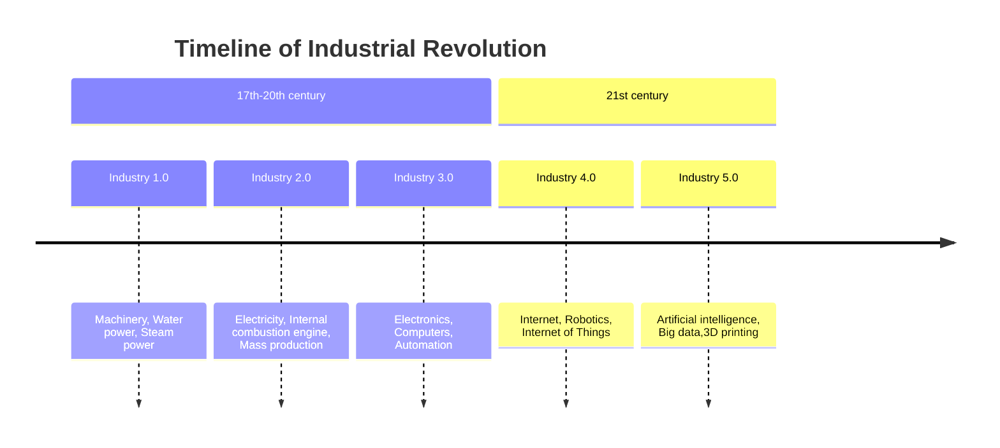

## Prüfungsfragen

- Nennen Sie drei wesentliche Unterschiede der Inhaltsanalyse im Vergleich zur Grounded Theory.
- Das soziale Wissen einer Gesellschaftnalyse, Reflexion, Positionieren, Beobachten, Verstehen
- Ergebnis-offen und nicht kausal
- Daten, Bild, Audio, Artefakte, Emotionen (Multisensorischer Turn)

**Wir nutzen Individuen, um Zugang zum sozialen zu erhalten.**

Feministische und  dekoloniale Methoden helfen marginalisierte Gruppen aufzuzeigen → **Intersektionalität**

### Take Home Sitzung 1

- DG & WT Zusammenfassung lesen
- Qualitative Methoden rekonstruieren soziales (kollektives) Wissen
- Methodenvielfalt
- Sozialkonstruktivismus, Handlungstheorie, Poststrukturalsimus

Offen und geschlossene Beobachtungsmethode

- Interviewtypen nachlesen!
- Suggestivfragen vermeiden
- Sprachsensible Formulierungen

- Der [[Strukturalismus]] ist eine Erkenntnistheorie, die davon ausgeht, dass **alle kulturellen Praktiken auf einem System von Regeln und Zeichen basieren**
- Der [[Poststrukturalismus]] basiert auf den Annahmen des [[Strukturalismus]], betont aber zudem, dass **Regeln und Systeme kulturelle Praktiken nicht nur ermöglichen respektive verunmöglichen, sondern einen wesentlichen Anteil an ihrer Konstruktion haben. Dinge haben Macht Bedeutung zu erzeugen.**

## Beispielinterview

**Thema**: Work life balance im geographiestudium

**Forschungsfrage**: Wie erleben Studierende der Geographie ihre Work-Life-Balance und welche Faktoren beeinflussen sie?

**Leitfragen:**

1. Arbeitest du neben dem Studium, und wenn ja wie viel?
2. Wie sieht ein typischer Wochen-/Studientag von dir aus? Wie sieht es am Wochenende aus?
3. Kommt entweder das Studium, dein Privatleben oder allenfalls ein Job zu kurz? Wie drückt sich das aus?
4. Gibt es Strukturen am System Universität welche deine Work-Life-Balance positiv oder negativ beeinflussen?
5. Welche Strategien wendest du persönlich an, um ein Gleichgewicht zwischen Studium, Arbeit und Freizeit zu halten?

### Inhaltsanalyse:

#### Ziele von Inhaltsanalysen

- Reduktion der Komplexität
- Ermöglicht Konzentration auf ein Thema und eine herausarbeitung der Position
- Kategorisierung
- Zusammenfassung
- Erste Ebene der Aussage (blosse Inhalte) Nicht möglich zu analysieren ob jemand lügt, Bedeutung bleibt verdeckt.

##### Mayring v Kuckartz

Mayring ist mehr theoriegeleitet → deduktiv

Kuckartz ist mehr Materialgeleitet → induktiv

#### Datenverwendung

- Was kann ich mit den Daten machen?
	- vergleichen / quantitativ zählen / Häufigkeitsanalysen
	- thematisch fokussieren
	- Inhaltsebene
- Was kann ich nicht machen?
	- Kontextualisieren
	- Semantik ist wenig zugänglich
	- Verallgemeinerung / Generalisierung
- Anwendungsbereiche
	- grosse Datenmengen
	- Zeitdruck
	- Mixed Methods
	- Inter- Transdisziplinarität

### [[Grounded Theory]]

- Theoriebildendes Verfahren
- W-Fragen
- In der transkription kann nichts ausgelassen werden. Grundannahme ist ja das wir nichts wissen.
- Offenes Codieren
	- In-vivo codes (Wörter direkt aus dem Dokument)
	- Menschen
	- W-Fragen
	- Prozesse
	- Strukturen
- Axiales Codieren
	- Zusammenhänge erforschen
	- Kernphänomene
		- selektives Codieren

## Diskursanalyse

1. **Drei Ziele, die Diskursforschende mit Diskursanalysen verfolgen:**
	1. **Identifikation von Machtstrukturen:** Eines der Hauptziele der Diskursanalyse ist es, die Machtstrukturen und -beziehungen in gesellschaftlichen Diskursen zu identifizieren. Dies hilft dabei, zu verstehen, welche Akteur*innen welche Ressourcen und Einflussmöglichkeiten haben.
	2. **Verstehen von Identitätsbildung:** Diskursforschende analysieren, wie durch Sprache Identitäten geschaffen, verändert oder verstärkt werden. Dabei kann es sich um individuelle, soziale oder kulturelle Identitäten handeln.
	3. **Entdeckung von Ideologien:** Diskursanalysen können dazu verwendet werden, die zugrunde liegenden Ideologien und Annahmen, die in einer bestimmten Diskussion oder Erzählung vorkommen, zu identifizieren und zu analysieren.
	4. Definition der Norm und der Abweichung davon. Was ist krank, was ist gesund? 
2. **Drei zentrale Analysegegenstände von Diskursanalysen:**
	1. **Akteur*innen:** Wer nimmt am Diskurs teil, und welche Rollen und Positionen nehmen diese ein? Das kann wichtige Erkenntnisse zur Machtverteilung und Einflussnahme liefern.
	2. **Sprachliche Elemente:** Hierbei geht es um die Analyse von Begriffen, Metaphern und anderen sprachlichen Elementen, die im Diskurs verwendet werden. Diese können viel über die impliziten Annahmen und Werte eines Diskurses verraten.
	3. **Kontext:** Die sozialen, politischen und historischen Kontexte, in denen ein Diskurs stattfindet, sind ebenfalls zentral. Sie beeinflussen, wie Diskurse interpretiert werden und welche Bedeutung sie haben.
3. **Diskutieren Sie, warum Diskursanalysen auch als politische Methode verstanden werden:** 
	1. Diskursanalysen können als politische Methode verstanden werden, weil sie Machtstrukturen und ideologische Prämissen offenlegen. Sie können dazu beitragen, gesellschaftliche Verhältnisse zu hinterfragen und alternative Sichtweisen zu fördern. Dadurch können Diskursanalysen als Werkzeug für soziale Veränderungen fungieren.
	2. Bsp. Gendergerechte Sprache: Die Art wie wir als Gesellschaft sprechen und wie wir marginalisieren
		1. Das kann gut und ok sein, jedoch müssen wir uns bewusst sein was wir machen. Wir sind alle Teil in der Reproduktion
4. **Beispiele für Diskursanalysen:**
	1. **Genderdiskurs:** Untersuchung der Sprache und der zugrunde liegenden Annahmen in Diskussionen über Geschlecht und Geschlechterrollen.
	2. **Klimawandeldiskurs:** Analyse von Sprache und Rhetorik in Diskussionen um den Klimawandel. Das kann Aufschluss darüber geben, wie verschiedene Akteur*innen den Klimawandel wahrnehmen und welche Lösungsansätze sie bevorzugen.
	3. **Diskurs über Migration:** Analyse von Medienberichten, politischen Reden usw., um zu verstehen, wie Migrant*innen und Migration in verschiedenen Kontexten dargestellt werden.

> Volksfest, Volksgemeinschaft, die Völker Europas, volksnah, volksentstammt, artfremd, staatsfeindlich, blutsverwandt, den Menschen aufziehen, verankern, ankurbeln, gleichschalten, stürmen, organische Wahrheit, natürliche Bedürfnisse, Werkzeuge der Geschichte, echte Helden, Ordnungsmacht, einzig, gigantisch, am größten, Parasiten, Bazillus, Säuberungen, Schmarotzer, ewig, Heilsgeschichte, bekennen

> Volksbuchhandlung, Jugendleben, Held der Arbeit, Wandzeitung, Kulturhaus, Massenarbeit, Volkseigene Güter, Brüderlichkeit, Verbrüderung, Menschengemeinschaft, Leitung und Planung, gesellschaftliche Entwicklung, Glück des Volkes, die Werktätigen, friedliche Koexistenz, Aufbau, Wohnungsbauprogramm, Westmächte, Imperialisten, Militaristen, helle Zukunft

> Verseuchung, Freiwild, sogenannte Flüchtlingen, Unding, Schlag ins Gesicht, verfehlt, fatal, Lug, Trug, verheimlichen, verräterisch, vertuschen, Journaille, Altparteien, Klartext, Invasoren, Volkskörper, Volksbeteiligung, Volksbegehren, Schwachsinn, Blindheit, Chaos, Desaster oder Dummheit, abartig, abnorm oder absurd, absolut, grundsätzlich, äußerst

- Da steckt offensichtlich mehr drin als nur die einzelnen Wörter
- Es gibt die Dinge die muss man nicht sagen, aber trotzdem wissen alle um was es geht
	- Wie erfassen wir das?
- Dinge sind immer Gesellschafts- und Zeitgebunden
	- In 500 Jahren verstehen wahrscheinlich nicht mehr alle was damit gemeint ist:
		- ![[Pasted image 20231009162232.png]]

- **Episteme**: Bestimmte Dinge, Handlungen, Gruppen, etc. werden immer marginalisiert,  Über lange dauer (Faucault war Geschichtswissenschafter)

> Ein Chirurg fährt mit seinem Sohn im Auto über Land. Es kommt zu einem schweren Unfall, der Vater stirbt noch am Unfallort, der Sohn wird schwer verletzt in ein Krankenhaus eingeliefert. Ein Ärzteteam bereitet dort die Operation vor. Kaum wird der Patient in den Operationssaal gerollt, sagt der Kopf des Ärzteteams, eine Kapazität auf dem Gebiet der Chirurgie: „Ich kann diesen Patienten nicht operieren, das ist mein Sohn“ 
> (Landwehr 2008:19).

- Sprache macht Dinge denkbar
- Sprache bestimmt wie wir Denken
- Diskurs regelt was wir denken und sagen können
	- Bspw. alternative Wirtschaftsform zum Kapitalismus ist immer lächerlich

Spannende Sprachanalyse: https://sprachkompass.ch/

#### Integrative Basisverfahren - Rekonstruktive Methoden der Sozailforschung (Jan Kruse)

Bezugnehmend zum linguistic turn fragt Jan Kruse zunächst: Was ist Versprachlichung?

- Bezug zur Dokumentarischen Methode von Karl Mannheim: **etwas steht für etwas**
- Hinter jeder Handlung (z.B. Sprechen) steht ein Motiv/Prinzip/Zuordnung
- Ziel ist die Rekonstruktion von Motiven, Prinzipien, Zuordnungen, 
- Abgrenzungen durch **Versprachlichung** 
- Motive zeigen sich in sprachlichen Phänomene.

1. **Sprache wird unterschieden in**
	- **Semantik:** Konzentration auf die Wortwahl wie Redewendungen, Allegorien, Fachsprache, Verben, Substantive, Akteure, Positionen, Orte, Zeiten
	- **Syntax:** Grammatik, Pronomen, Negationen, Passivkonstruktionen, grammatikalische Besonderheiten  
	- **Pragmatik:** Interaktion, Selbst- und Fremdpositionierungen, Anrufungen, Aufrufe, Aktionen 
2. Sprache wird von **Akteuren** gesprochen. Es stellt sich somit die Frage: **Wer spricht?**
3. Akteure nehmen beim Sprechen **Bezug** auf andere **Subjekte** (z.B. Personen) und/oder **Objekte** (z.B. Dinge, Phänomene). Es stellt sich somit die Frage: **Wer spricht wie über wen oder was?**

![[Pasted image 20231009171501.png]]

1. Sprachliche Zuordnung (Linguistische Analyse um eigenen Interpretation möglichst auszuschliessen) Semantik, Syntax, Pragmatik, Akteure, Subjekte
2. Einteilung, Analyse mir Axialer Clusterung mit Scannern
3. Interpretation

