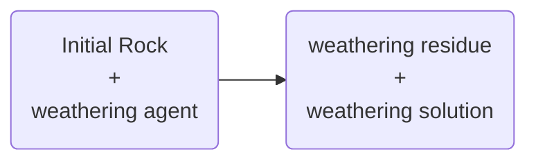

Soil Science I

Learning outcomes

1.     The students can identify the different soil components and describe their role in the formation of soils and their impact on soil properties.

2.     They can explain the most important soil formation processes.

3.     They can describe physical and ecological (biological and chemical) soil properties.

4.     They are able to explain the classification of the most important soil types.

# 1       Soil Function Vorlesung 18.9

Prüfung wahrscheinlich Woche 7, 45’ in english online

## 1.1       Literatur allgemein

·      Blum W., Schad P., NortcliffS., Essentials ofSoil Science, Soil formation, functions, useand classification (World referencebase, WRB) Gebr. Borntraeger, Berlin, 7th edition, 2018

·      Zech W., Schad P., Hintermaier-Erhard G., Soils oftheWorld, Springer Spektrum, 2022

·      Scheffer-Schachtschabel, SoilScience, Spektrum Akademischer Verlag, 17th edition, Heidelberg, 2018

## 1.2       Soils within the Earth system

1/32 der Erdoberfläche ist nutzbarer Boden.

**Bodenfunktionen**

-       Archiv

-       Produktion

-       Trägerfunktion

-       Rohstoffe

-       Lebensraum

-       Stoffregulation

Erweitert:

-       Water purification and soil contaminant reduction

-       Climate regulation

-       Nutrient cycling

-       Habitat for organisms

-       Flood regulation

-       Source of pharmaceuticals and genetic resources

-       Foundation for human infrastructure

-       Provision of construction materials

-       Cultural heritage

-       Provision of food, fibre and fuel

-       Carbon sequestration

  

-       Archiv

o   Kulturelles Archiv

o   Pollenarchiv

-       Produktion

o   Different Soil types for different products

-       Trägerfunktion

-       Rohstoffe

o   60 mio Tonnen Kiesabbau pro Jahr in der Schweiz (Häufig Moränenmaterial)

-       Lebensraum

o   Viele symbiotische Beziehungen im Boden

o   Penicilium Pilz im Boden für Pencilin → Antibiotika

o   Leben wird zu Boden, verschmutzungen bleiben lange im Boden

o   1 Ha of soil x 30 cm depth = **25 tons** **of soil organisms-**10t bacteria and archaea

§  10t fungi, slime molds and algae

§  4 t earthworms

§  1 t other animals

-       Stoffregulation

o   Kontrollfunktion als offenes System

§  Filtration

§  Buffering (adsorption)

§  Transformation (alteration and decomposition)

§  Solution

·      Uptake into plant roots

·      Output into Groundwater

## 1.3       Threats

o   Urbanisationrate in Switzerland 1 m2 s-1 ungefähr 10 Fussballplätze pro Tag

o   Forests are protected and ist primarily agricultural land that is built over

o   **Soil compaction** leads to decreased groundwater recharge. Flooding risk

o   **Soil erosion:** Washing away of fertile soil 4.5 t ha-1 a-1 

o   in single events up to 50 t ha-1 a-1

o   Soil regeneration 3.8 – 7.5 t ha-1 a-1

o   Often caused by bad management

o   **Soil pollution**

o   Atmospheric pollution

o   Ground or surface water

o   Direct effects of land management (agriculture, industry, waste, mining)

o   Geogenic pollution (bedrock)

o   Pollutants

§  Inorganic pollutants

§  Organic pollutants

§  Radioactive pollutants

o   Soil acidification

## 1.4       Key messages for soil functions

**Ecologicaland economical soil functions can only be fulfilled if:**

o   Water balance and aeration

o   Rootability

o   Nutrients and soil organisms in balance

o   Tolerable levels of pollutants for plants and living organisms

**All human activities on the soil must be taken into account:**

o   Soil not reproducible (veryslow regeneration)

o   Support for structures

o   Sink for pollutants

o   Only an intact soil structure guarantees the functioning of soil functions

## 1.5       Key points for soil protection

1.     Knowledge (soil is not dirt)

2.     Precautionary soil protection

3.     Coordinated soil monitoring and surveillance(NaBo)

4.     Sustainable, carefuluse

5.     Remediate polluted soils to such an extent that there is no danger

6.     Soil = common property. Whoever uses soil is responsible for its protection

7.     Integrity of the soil is ensured by legal standards

8.     Soil protection = corporate mandate > improve institutional conditions for soil protection + financial resources

9.     Implement soil protection by all actors

10.  Important partners in soil protection: spatial planning, agriculture and forestry

Video 2 Alpine soils

-       15’000 Jahre alte Böden

-       **Gefahr der Verwaldung**

-       Nicht bewirtschaftete Flächen neigen in steilem Gelände zu Erosion

o   Boden kann das Wasser nicht mehr aufnehmen

o   Oberflächiger Abfluss

-       Schwänden als Schutz vor Verwaldung

-       **Funktion: Hotspots der Biodiversität**

Video 3 Schutzwälder

-       Waldboden als Schwamm, langsame Abgabe der Feuchtigkeit

-       Dünne Decken auf Gestein

-       Schlecht gewartete Forststrassen führen zu Konzentration von Oberflächenwasser und damit zu Rutschungen

-       Nährstoffsituation darf durch Nutzung nicht verschlechtert werden

o   Ast- und Nadelmaterial bleibt nach Fällung im Wald

Video 7 soil and tourism

-       Kurze Vegetationszeit

-       Lange Entstehungszeit und dünne Schichten

-       Einfluss des Kulturlandschaftsbildes auf Tourismus

-       Gefahr Infrastrukturanalgen wie Seilbahnen

|   |   |   |
|---|---|---|
|Alpine meadows|Protective Forrest|Touristic areas|
|-       Provision of Food, Fibre, Fuel  -       Habitat  -       Regulation  -       Tourism, recreation|-       **Protection**  -       Water regulation  -       Nutrient regulation|-       Support for Infrastructure  -       Habitat  -       Tourism|
|-       Erosion (high grass catches snow and “flows” downward  -       “Ingrowing” forests|-       Lack of knowledge of how to take care  -       Erosion|-       Pollution  -       Compaction  -       Erosion|

  

# 2       Soil definitions

What is soil?

-       Organic matter

-       All three phases (liquid, gas, solid)

-       Chemical-, physical-, and biological processes

-       **Surface component of the earth**

-       Chemical conversion of the parent material

Sediment = Displaced soil without in situ soil formation **→ not a soil**

Regolith = weatherd roch without biological influence **→ not a soil** (bspw. Marsoberfläche)

Coal and peat = biogenic sediments**→ not a soil** (peat = Torf)

Pedosphere as an area of extremes

## 2.1       Soil horizons

Solum = total of horizons, no OM, no bedrock

Soil type classifications: Bodenart

-       Same horizon sequence

-       Same characteristics

Soil type can also refer to grain size: Bodentyp

Horizons arise from the (geologic) substrate trough soil-forming processes:

-       Weathering

-       Mineral formation

-       Decomposition of litter and humus formation

-       Microstructure formation

-       Material transfer

Horizon is different from a layer wich include OM and bedrock → bspw sedimentology

S = Soil

G = Geology/Geochemistry

C = Climate

T = Topography

O = Organism

**A = Anthropogenic activity**

Z = Time

Catena = Relief controlled soil science

 

Chronosequence = chronological sequence of soil development. (Bspw. In tropischen Gebieten wichtiger, da schneller bodenbildung bspw. nach Gletscherrückzug)

# 3       The solid Phase of Soil

JESUS CHRISTUS ISCH DAS LÄNGWIIILIG

-       The rocks underneath the soil largely determines the development of the soil.

Magmatic Rocks

-       Soils on top are quite deep

-       good for agriculture

Metamorphic Rocks

Sedimentary Rocks

-       cover 75% of the earths surface

o   **Clastic sedimentary rocks** such as breccia, conglomerate, sandstone, shale  
-> formed from mechanical weathering of debris.

o   **Chemical sedimentary rocks**, such as rock salt, iron ore, flint, some dolomites, and some limestones  
-> formed when dissolved materials precipitate from solution.

o   **Organic sedimentary rocks** such as coal, some dolomites, and some limestones  
-> form from the accumulation of plant or animal debris.

## 3.1       Minerals

-       Whitered Minerals form the parental rocks are called primary minerals

-       secondary minerals can form in the soil

-       The earths crust is composed by 50% Oxygen and 25% Silicon

-       (SiO4)4- Tetraeder

-       Orthosilicates (Inselsilikate) Olivin

o   No isomorphic substitution

-       Chani and Band silicates

o   Pyroxens: One Chain

o   Amphibol: Double Chains or Bands

o   Sensitive to weathering

-       Layer-silicates

o   mica -> Glimmer

-       Tectosilicates (Gerüstsilikate)

**Clay**

-       Different possible Interlayer → Crèmeschnitte!!!

-       Three Layer Clays

o   Kaolinite

o   Illite

o   Smectite, Vermiculite

o   Chlorite

-       Weathering between primary minerals and secondary minerals mnerals is one way, but within secondary minerals transformation can happen

Minerals break down in different rates

Source of nutrients

Primary minerals can form secondary minerals

Clays and iron oxides (both secondary) are verry important in soils

## Vorlesung 4 - Weathering and secondary minerals

- Weathering is the change of minerals and rocks in contact with the atmosphere, biosphere and hydrosphere.
![[Weathering]]

### Physical weathering
- crushing of the material
- reduction of the grain size
- pressure release (or change) 250 bar
- gravity
- temerature exposure 500 bar
- Salt-crystal grwoth (salt-weathering) 100 bar
	- ![[Pasted image 20231009142527.png]]
- Ice blast / frost effect 2000 bar
- root growth (physical because its the pressure, that is cracking the stone)  10 bar

### Chemical weathering

- Hydration
- hydrolisis & protolysis
![[Pasted image 20231009144148.png]]
  
- weathering stability of minerals
	- Olivine < Pyroxene< Amphibole < Biotite< Plagioclase< Muscovite≈ Orthoclase< Quartz
### Grain size
  
The **grain size= particle size** (synonym: **texture**) of the soil is the distribution of the size of soil particles.

**Importance of the grain size:**
- Pore distribution (porosity)
- Water and air budget
- Transport of substances and the sorption of substances (filter function)
- Life processes in soil
- Erosion
- Micro structure formation

Soil skeleton

| Designation                          | Coarse   | Medium    | Fine     |
| ------------------------------------ | -------- | --------- | -------- |
| Blocks, boulders: angular, rounded   |          | > 200 mm  |          |
| Stones: angular, rounded             |          | 63-200 mm |          |
| Gravel: rounded                      | 63-20 mm | 20-6.3 mm | 6.3-2 mm |

Fine earth fraction

| Designation     | Coarse      | Medium      | Fine       |
| --------------- | ----------- | ----------- | ---------- |
| Sand 2000-63 µm | 2000-630 µm | 630-200 µm  | 200-63 µm  |
| Silt 63-2 µm    | 63-20 µm    | 20-6.3 µm   | 6.3-2.0 µm |
| Clay < 2 µm     | 2.0-0.63 µm | 0.63-0.2 µm | < 0.2 µm   |

![[Pasted image 20231009152531.png]]
#### Grain size and soil functions
- Soil physical properties
	- The sandier, the more permeable, the less water storage, because of large pores
	- The more clayey, the more impermeable, the higher the water storage and the more stagnant water, because of fine pores
	- The more silty, the greater the storage capacity for water available to plants, because it has medium pores
- Soil chemical properties
	- The sandier, the less nutritious and the lower the buffer capacity
	- The more clayey, the more nutritious and the greater the buffer capacity
## Organic matter in Soil
### Carbon Cycle
![[Pasted image 20231009153326.png]]

- A few % but very important
- Stabilisation of OM
- Equilibrium of OM
- Sorbent
- Soil stabilisation, aggregates
- Source of C and energy
- Soil OM, SOM = humus (Soil organic matter)
