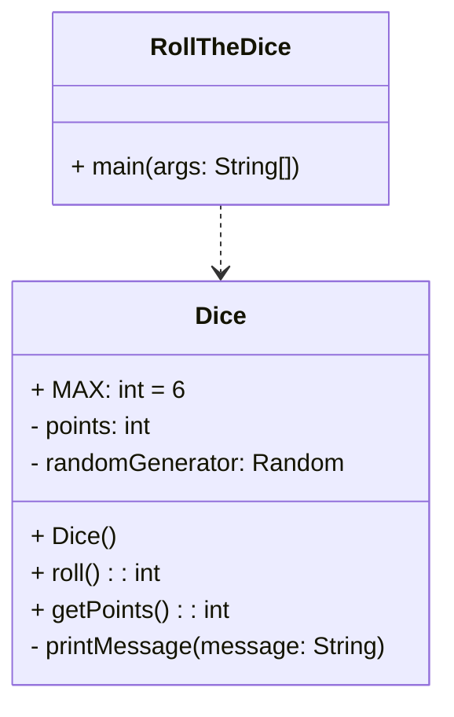

## tl;dr Kapitel 4.1 bis 4.9

- Klassen enthalten _Variablen_ und _Methoden_ (Eigenschaften und Verhalten)
- *Sichtbarkeitsmodifikatoren* (`public`/`private`) bestimmen, was extern oder nur intern referenziert werden kann
- Variablen sollten `private` deklariert werden. Methoden können `private`oder `public` deklariert werden (je nach Zweck)
```java
public class Integer { 

	private int value;
	public Integer(int value) {
		this.value = value;
	}
	
	public String toString() {
		return this.value + "";
	}
		
	public void setValue(int value) {
		this.value = value; 
	} 
}
```

- Methoden bestehen aus _Methodenkopf_ und _Methodenrumpf_ 
- Methodenkopf: (1) _Sichtbarkeit_ (2) _Datentyp_ der Rückgabe oder `void` (3) _Bezeichner_ (4) _Formale Parameter_ in Klammern
- _Konstruktoren_ besitzen _keinen_ Rückgabetyp und heissen immer gleich wie die zugehörige Klasse

```java
public Integer(int value) { 
	this.value = value;
}

public String toString() {
	return this.value + "";
}

public void setValue(int value) {
	this.value = value;
}
```

- Konstruktoren instanziieren Objekte aus der Klasse und geben eine Referenz auf das Objekt zurück.

```java
Integer num1 = new Integer(17);
```

- _Tatsächlicher Parameter_: Wird beim Aufruf an die Methode mitgegeben

```java
num1.setValue(99);
```

- _Formaler Parameter_: Bezeichner, in den der tatsächliche Parameter kopiert wird

```java
public void setValue(int value) {
	this.value = value;
}
```

- Methoden können mit einer `return` Anweisung „etwas“ zurückgeben
- Der Rückgabetyp und der Datentyp der Rückgabe müssen übereinstimmen

```java
public String toString() {
	return this.value + ""; 
}
```

```java
String value = num1.toString();
```

## Abschnitte 4.10 und 4.11

### 4.10 UML Klassendiagramme

- UML = Unified modelling language



### 4.11

- Es ist möglich mehrere Konstruktore zu definieren

> [!Important]
> Sie **müssen** sich in den formalen Parameter unterscheiden

- Methode `toString()`
	- Insbesondere zu Testzwecken immer empfehlenswert

## Aufgaben zu Kapitel 4

- Was ist jeweils ==Klasse==, was _Objekt_?
	- ==Zutat==, *Butter*
	- *Birke*, ==Baum==
	- *Bern*, ==Kanton==
	- ==Schiff==, *Titanic*
	- *Toyota*, ==Auto==
	- *Programmierung 1*, ==Vorlesung==
	- ==Bankkonto==, *Konto 12345*
- Listen Sie einige _Eigenschaften_ und _Verhalten_ auf, die für eine Klasse `BankAccount` definiert werden könnten.
	- Eigenschaften
		- Name, Adresse, etc. des Inhabers (Eigentlich wieder ein Objekt)
		- Kontonummer
		- Kontoart
		- Kontostand
		- Währung
		- Maximaler Rückzug
		- Spesen
		- Zins
		- etc.
	- Verhalten
		- Geld hinzufügen
		- Geld abheben
		- Zins berechnen
		- Inhaber hinzufügen
		- etc.
- Definieren Sie eine _Support Methode_ `cube`, welche eine ganze Zahl `val` als Parameter erwartet und `val` hoch 3 zurückgibt.

```java
private int cube(int val) {
	return val * val * val;
}
```

- Welche Ausgabe erzeugt die Methode `doSomething` beim Aufruf `doSomething(-1);`

```java
public void doSomething(int parameter) {
	if (parameter < 0)
		return;
	System.out.print("Do Something");
}
```

Es erfolgt keine Ausgabe, da die Methode mit einer `void` Rückgabe definiert wurde, und der Befehl `return` vor der `System.out.print("Do Something");` paltziert wurde. Der Befehl geht also **sofort** zurück. *leeres return*

Definieren Sie eine _Service Methode_ `randomInRange`, welche zwei ganze Zahlen `low` und `high` als Parameter erwartet und eine Zufallszahl im Bereich `[low, high]` zurückgibt. Geben Sie `0` zurück, falls `low` grösser-gleich `high` ist.

```java

import.util.Random;

private int randomInRange(int low, int high){
	if (low >= high) {
		return 0;
	} else { //nicht unbedingt nötig, da return vorher geschieht
		Random rand = new Random();
		return rand.nextInt(high - low + 1) + low;
	}
}
```

## Die Klasse `BankAccount`

```java

```

