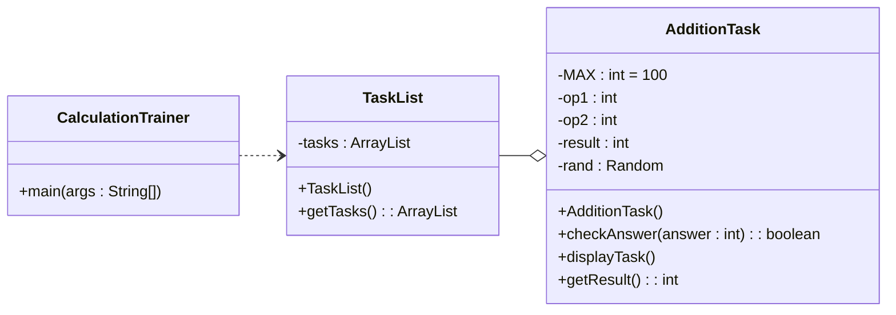

## Aufgaben zu Kapitel 5

- Weshalb besitzt die Klasse Math keinen Konstruktor?
	- 
- Was ist die Rückgabe folgender Ausdrücke:
	- `Math.pow(5, 3);`
	- `Math.sqrt(81);`
	- `Math.abs(15.1 - 17);`
	- `Math.ceil(4.5);`
	- `Math.floor(4.5);`
	- `Math.round(4.5);`
- Schreiben Sie eine Service Methode `distance`, welche zwei Objekte vom Typ `Point` entgegennimmt und die *Euklidische Distanz* zwischen den beiden Punkten berechnet und zurückgibt.
- Definieren Sie eine Variable `num`, welche den grösstmöglichen `int` speichert.
- „Verpacken“ Sie den Wert `3.456` in einem Objekt.
- Gegeben sei `input = “false“;` Weisen Sie einer Variablen `on` vom Typ `boolean` den Wahrheitswert zu, der aktuell in input gespeichert ist? (Achtung: `input` könnte auch `“true“` referenzieren.)
- Folgende Methode kompiliert nicht. Weshalb nicht? Korrigieren Sie — der Rückgabetyp darf dabei aber nicht verändert werden!

```java
public String returnResult(int op1, int op2) {
	return op1 + op2
}
```

- Welche Ausgaben erzeugen folgende Schleifen?

```java
int count = 1;
while (count != 10) {
	count += 2;
	System.out.println(count);
}
```

```java
int i = 1, max = 3;
while (i < max) {
	System.out.println(i);
	i++;
}
```

```java
int i = 5;
while (i >= 0) {
	i -= 2;
	System.out.println(i);
}
```

```java
int i = 1, max = 3;
while (i < max) {
	int j = i;
	while (j >= 0) {
		System.out.println(i + " " + j);
		j--;
	}
	i ++;
}
```

- Welche Ausgabe erzeugt das folgende Code-Fragment?

```java
ArrayList<String> names = new ArrayList<String>();
names.add("Emilie");
names.add("Maxime");
names.add(1, "Noelle");
names.add(1, "Eliane");
names.remove(2);
names.set(1, "Maya");

Iterator<String> iter = names.iterator();
while (iter.hasNext())
	System.out.print(iter.next() + " ");
	
System.**_out_**.println(names.indexOf("Noelle"));
```

> [!Aufgabe]
> Schreiben Sie ein Programm, das das _Hi-Lo Ratespiel_ implementiert. Das Programm soll eine zufällige ganze Zahl zwischen `1` und `100` wählen und dann den Benutzer bitten, die Zahl zu erraten.
> 
> Nach jedem Rateversuch gibt das Programm aus, ob richtig geraten wurde oder nicht. Wenn falsch geraten wurde, soll das Programm einen Tipp geben, ob die gesuchte Zahl grösser oder kleiner als der letzte Rateversuch ist. Am Schluss geben Sie aus, wie oft geraten werden musste, bis der Benutzer die Zahl erraten hat.
> 
> Nachdem der Benutzer die Zahl korrekt erraten hat, wird er gefragt, ob er nochmals spielen will. Das Ganze wiederholt sich so lange, bis sich der Benutzer nach einigen Spielen entscheidet, das Programm zu beenden.



## java Code Challenge

1. Als _Palindrom_ werden Wörter, Wortreihen oder Sätze bezeichnet, die rückwärts gelesen genau denselben Text ergeben (z.B. _Rentner_ oder _Regallager_). Schreiben Sie ein Java-Programm, das eine Zeichenkette akzeptiert und überprüft, ob diese ein Palindrom ist oder nicht.
2. Schreiben Sie ein Java-Programm, das einen MD5-Hash zurückgibt. MD5 (Message-Digest-Algorithmus 5) ist eine kryptographische Funktion zur Erstellung von 128-Bit-Hashes aus Zeichenketten (obwohl die Funktion als gebrochen gilt, ist sie dennoch als Programmierübung nützlich). Recherchieren Sie den Algorithmus und schreiben Sie ein Programm, das eine alphanumerische Zeichenkette akzeptiert und den MD5-Hash für diese Zeichenkette zurückgibt.


