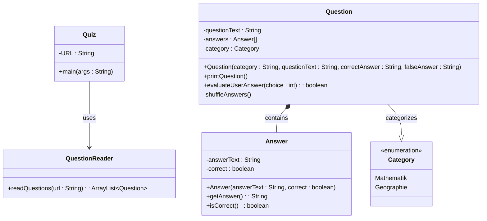

## tl;dr Kapitel 7-8

- *Arrays* ermöglichen das Deklarieren einer *einzigen* Variablen eines Typs, die dann _mehrere Werte_ dieses Typs speichern kann
- Arrays haben eine _feste, unveränderliche Größe_ (Konstante `length`), die bei der Instanziierung angegeben werden muss

```java
int num1, num2, num3, num4, num5, num6;
```

```java
int[] nums = new int[6];
```

```java
int l = nums.length;
```

- Auf einzelne Elemente eines Arrays greift man mit einem _Index_ innerhalb eckiger Klammern zu

```java
for (int i = 0; i < nums.length; i++) {
	System.out.println(nums[i]);
}
```

- Mit _Initialisierungslisten_ können Arrays instanziiert und mit Werten gefüllt werden

```java
int[] nums = {1, 2, 3, 4};
String[] names = {"Goodbye", "Hello", "Hi", "Howdy"};
```

- Auf Methoden der in einem Array gespeicherten Objekte kann man über _Array-Referenzen_ zugreifen

```java
for (int i = 0; i < names.length; i++) {
	names[i] = names[i].toUpperCase();
}
```

- Der Parameter der Methode `main` ist ein `String[]`. Dies sind _Programmparameter_, die beim Start des Programmes von „Außen“ mitgegeben werden können

```java
public static void main(String[] args) {
	String language = args[0];
	String version = args[1];
	String author = args[2];
}
```


- Methoden können mit _variablen Parameterlisten_ umgehen

```java
public static int min(int first, int ... others) {
	int min = first;
	for (int num : others) {
		min = Math.min(min, num);
	}
	return min;
}
```

```java
public class Greetings {
	private String primaryGreeting;
	private String[] greetings;

	public Greetings(String primaryGreeting, String ... otherGreetings) {
		this.primaryGreeting = primaryGreeting;
		this.greetings = otherGreetings;
	}
}
```

- Zweidimensionale Arrays sind Arrays aus Arrays

```java
int[][] table = new int[100][5];
String[][] names = {{"Anne", "Barbara", "Cathrine"}, {"Danny", "Emilie", "Fanny"}};
```

- Für Referenzen auf Elemente in zweidimensionalen Arrays werden zwei Indizes benötigt

```java
System.out.println(names[0][2]);

for (int row = 0; row < names.length; row++) {
	for (int col = 0; col < names[row].length; col++) {
		names[row][col] = "Hannes";
	}
}
```

### enum

- Ein enum zählt _alle_ zulässigen Werte eines Typs auf

```java
public enum Category {
	Mathematik, Geographie
}
```

```java
public enum Category {
	Mathematik(10), Geographie(3);

	private int points;

	private Category(int points) {
		this.points = points;
	}
}
```

- Jedes enum Objekt besitzt Methoden (wie z.B. `name()`)

- Jede enum Klasse besitzt statische Methoden (wie z.B. `values()`)

```java
Category[] categories = Category.values();
for (Category category : categories) {
	System.out.println(category.name());
}
```

### Statische Variablen

- *Statische Variablen* werden von allen Instanzen geteilt (es existiert also nur *eine* Kopie der Variablen für alle Objekte)

```java
public class Person {
	public static int globalCount = 0;
	private int id;

	public Person() {
		this.id = Person.globalCount++;
	}
}
```

- Statische Methoden werden direkt aufgerufen, ohne vorher ein Objekt zu instanzieren

```java
Functions.generateRandoms();

public static int[] generateRandoms() {
	// Macht etwas
}
```

### Abhängigkeiten

#### Selbstabhängig

- Eine Klasse kann von sich selbst abhängig sein

```java
Person p1 = new Person("Emilie");
Person p2 = new Person("Ava");
Person p3 = new Person("Maya");

p1.knows(p2);
p1.knows(p3);

System.out.println(p1.getFriends()); // [Ava, Maya]
```

```java
public class Person {
	private String name;
	private ArrayList<Person> friends;

	public Person(String name) {
		this.name = name;
		this.friends = new ArrayList<Person>();
	}

	public void knows(Person other) {
		this.friends.add(other);
	}

	public String toString() {
		return this.name;
	}

	public ArrayList<Person> getFriends() {
		return this.friends;
	}
}
```

#### Aggregation

- Aggregation := Ein Objekt besteht z.T. aus anderen Objekten

```java
public class Person {
    private String name;
    private Address address;

    public Person(String name, Address address) {
        this.name = name;
        this.address = address;
    }
}

public class Address {
    private String street;
    private int zipCode;

    public Address(String street, int zipCode) {
        this.street = street;
        this.zipCode = zipCode;
    }
}
````


## Aufgaben

### Was ist die Ausgabe des folgenden Code-Fragmentes?

```java
public enum Day {
    monday(true), tuesday(true),
    wednesday(true), thursday(true),
    friday(true), saturday(false), sunday(false);
    private boolean workDay;

    private Day(boolean workDay) {
        this.workDay = workDay;
    }

    public boolean isWorkDay() {
        return this.workDay;
    }
}
```

```java
Day day1, day2;
day1 = Day.monday;
day2 = Day.saturday;
System.out.println(day1.name());
System.out.println(day2.ordinal());
Day[] days = Day.values();
for (Day d : days) {
    if (!d.isWorkDay()) {
        System.out.println(d.ordinal() + " " + d.name());
    }
}
```

#### Lösung

```text
monday
5
5 saturday
6 sunday
```

### Passen Sie die Klasse so an, dass Sie jederzeit wissen, wie hoch die aktuelle Gesamtsumme aller Bankkonti ist

```java
public class BankAccount {
    private final double INTEREST_RATE = 0.015;
    private final double FEE = 2.50;
    private String ownerName;
    private int accountNumber;
    private double balance;

    public BankAccount(String ownerName, int accountNumber) {
        this.ownerName = ownerName;
        this.accountNumber = accountNumber;
        this.balance = 0.0;
    }

    public void deposit(double amount) {
        this.balance += amount;
    }

    public void withdrawal(double amount) {
        double b = this.balance - amount - FEE;
        if (b >= 0.0) {
            this.balance = b;
        } else {
            System.out.println("Kontostand zu niedrig");
        }
    }

    public void computeInterest() {
        double interest = this.balance * INTEREST_RATE;
        this.balance += interest;
    }
}
```

#### Lösung

```java
public class BankAccount {

	...
	
    private static double totalAmmount = 0.0;

	...

    public void deposit(double amount) {
        this.balance += amount;
        BankAccount.totalAmmount += amount;
    }

    public void withdrawal(double amount) {
        double b = this.balance - amount - FEE;
        if (b >= 0.0) {
            this.balance = b;
            BankAccount.totalAmmount -= amount + FEE;
        } else {
            System.out.println("Kontostand zu niedrig");
        }
    }

    public void computeInterest() {
        double interest = this.balance * INTEREST_RATE;
        this.balance += interest;
        BankAccount.totalAmmount += interest;
    }
}
```

### Was ist der Unterschied zwischen einer Instanzvariablen und einer statischen Variablen?

#### Lösung

- Instanzvariablen werden für jede Instanz seperat erstellt und können für jede Instanz unterschiedliche Werte haben.
- Statische Variablen existieren nur einmal pro Klasse und wird von allen Objekten dieses Typs geteilt. Dies spart u.A. Speicherplatz

### Welche Arten von Variablen kann die Methode `main` referenzieren?

#### Lösung

- Lokale und statische Variablen
- Aus statischen Methoden kann nicht auf instanzvariablen zugegriffen werden (main ist statisch)

### Was ist der Vorteil oben links gezeigten Lösung gegenüber der unten gezeigten Umsetzung?

```java
public enum CardSuit {
    clubs, diamonds, hearts, spades
}

public class Card {
    private CardSuit cardSuit;

    public Card(CardSuit cardSuit) {
        this.cardSuit = cardSuit;
    }
}
```

```java
public class Card {
    private String cardSuit;

    public Card(String cardSuit) {
        this.cardSuit = cardSuit;
    }
}
```

#### Lösung

- Gerade in diesem Beispiel wo sowieso nur vier verschiedene Varianten möglich sind erhöht dies massiv die **Typsicherheit**!

### Passen Sie die Klasse so an, dass neu instanziierte rationale Zahlen immer automatisch gekürzt werden:

```java
public class RationalNumber {

	private int numerator, denominator;
	
	public RationalNumber(int numerator, int denominator) {
		this.numerator = numerator;
		this.denominator = denominator;
	}
	
	private int gcd() {
		int a = this.numerator;
		int b = this.denominator;
		while (a != b)
			if (a > b)
				a -= b;
			else
				b -= a;
		return a;
	}
}
```

#### Lösung

```java
public class RationalNumber {

	private int numerator, denominator;
	
	public RationalNumber(int numerator, int denominator) {
		this.numerator = numerator;
		this.denominator = denominator;
		this.reduce();
	}

	private void reduce() {
		int gcd = this.gcd();
		this.numerator /= gcd;
		this.denominator /= gcd;
	}
	
	private int gcd() {
		int a = this.numerator;
		int b = this.denominator;
		while (a != b)
			if (a > b)
				a -= b;
			else
				b -= a;
		return a;
	}
}
```

## Quiz Programmieren




![[Pasted image 20231110142050.png]]
